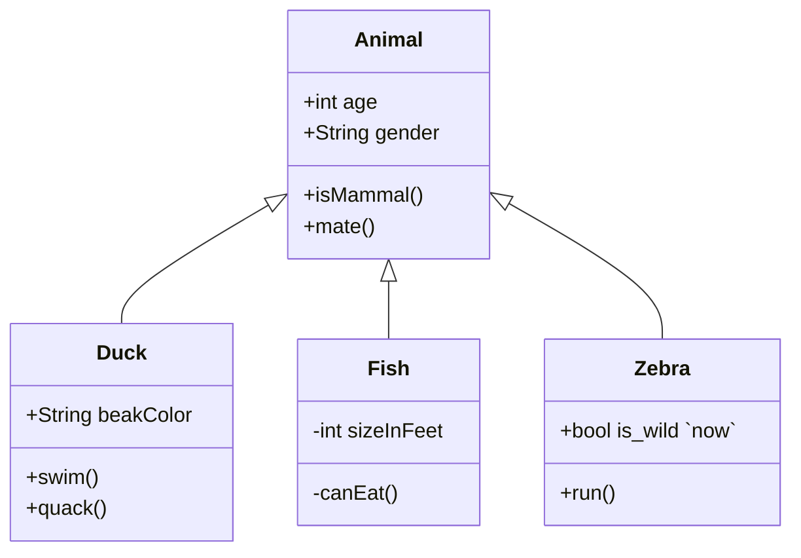

Bilty

<br/>

<br/>


<!-- NOTE-swimm-snippet: the lines below link your snippet to Swimm -->
### 📄 communication.js
```javascript
🟩 20         let now = new Date(),
🟩 21             startString = now.getFullYear() + "-" + (now.getMonth() + 1) + "-" + (now.getDate()),
🟩 22             end = new Date((new Date()).setDate(now.getDate() + (range || 7))),
🟩 23             endString = end.getFullYear() + "-" + (end.getMonth() + 1) + "-" + (end.getDate());
🟩 24         return [startString,endString]
```

<br/>

<br/>

<br/>

<!--MERMAID {width:100}-->

<!--MCONTENT {content: classDiagram<br/>
Animal <|-- Duck<br/>
Animal <|-- Fish<br/>
Animal <|-- Zebra<br/>
Animal : +int age<br/>
Animal : +String gender<br/>
Animal: +isMammal()<br/>
Animal: +mate()<br/>
class Duck{<br/>
+String beakColor<br/>
+swim()<br/>
+quack()<br/>
}<br/>
class Fish{<br/>
\-int sizeInFeet<br/>
\-canEat()<br/>
}<br/>
class Zebra{<br/>
+bool is\_wild `now`<swm-token data-swm-token=":communication.js:20:3:3:`    let now = new Date(),`"/><br/>
+run()<br/>
}<br/>} --->

<br/>

This file was generated by Swimm. [Click here to view it in the app](http://localhost:5001/repos/ls4DA2fLasmQuEbT4ipw/docs/qgym2).