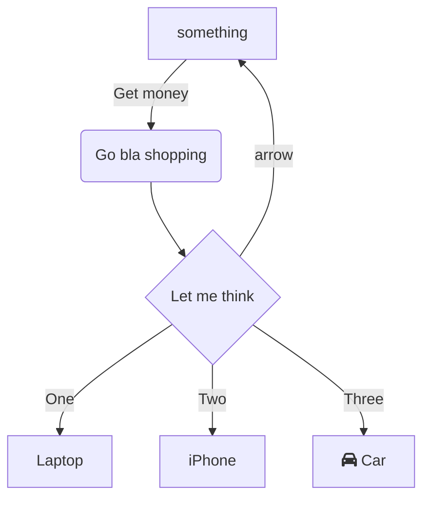

huijklhjk

 

 

<!--MERMAID {width:100}-->

<!--MCONTENT {content: "graph TD \nA\\[Christmas\\] \\-\\-\\>|Get money| B(Go bla shopping) \nB \\-\\-\\> C{Let me think} \nC \\-\\-\\>|One| D\\[Laptop\\] \nC \\-\\-\\>|Two| E\\[iPhone\\] \nC \\-\\-\\> |arrow| A\\[something\\] \nC \\-\\-\\>|Three| F\\[fa:fa-car Car\\]"} --->

 

BLA

 

This file was generated by Swimm. [Click here to view it in the app](https://swimm-web-app.web.app/repos/ls4DA2fLasmQuEbT4ipw/docs/8y9si).