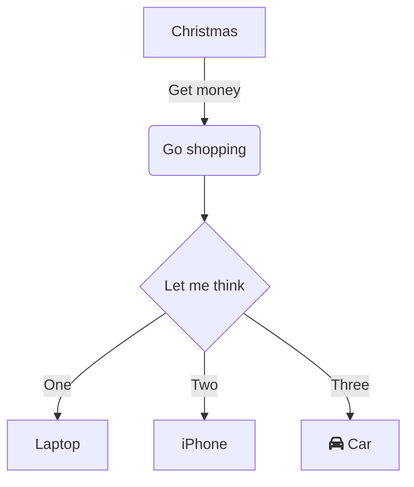

vfdsbfdgs

 

 

<!--MERMAID {width:100}-->

<!--MCONTENT {content: "graph TD \n\n \n\n \n\n \n\nA\\[Christmas\\] \\-\\-\\>|Get money| B(Go shopping)\n\n \n\n \n\n \n\n \nB \\-\\-\\> C{Let me think} \nC \\-\\-\\>|One| D\\[Laptop\\]\n\n \n\n \n\n \nC \\-\\-\\>|Two| E\\[iPhone\\] \nC \\-\\-\\>|Three| F\\[fa:fa-car Car\\]\n\n \n\n \n\n "} --->

 

This file was generated by Swimm. [Click here to view it in the app](http://localhost:5001/repos/ls4DA2fLasmQuEbT4ipw/docs/s9w4h).