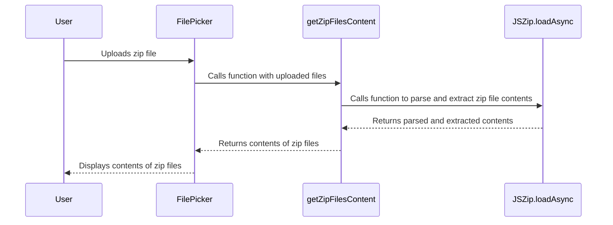

## How do we import zip files?

The `JSZip.loadAsync` function is used to parse and extract zip file contents. The `fileContent` is fetched using the `async` function of the zip file content. If the file is a `BlobFileExtensions`, it needs to be extracted using the `base64` param, and text files are exported using `text` param.

More info in the

 

<!--MERMAID {width:100}-->

<!--MCONTENT {content: "sequenceDiagram \nparticipant User \nparticipant FilePicker \nparticipant getZipFilesContent \nparticipant JSZip.loadAsync \nUser->>FilePicker: Uploads zip file \nFilePicker->>getZipFilesContent: Calls function with uploaded files \ngetZipFilesContent->>JSZip.loadAsync: Calls function to parse and extract zip file contents \nJSZip.loadAsync\\-\\-\\>>getZipFilesContent: Returns parsed and extracted contents \ngetZipFilesContent\\-\\-\\>>FilePicker: Returns contents of zip files \nFilePicker\\-\\-\\>>User: Displays contents of zip files"} --->

 

This file was generated by Swimm. [Click here to view it in the app](http://localhost:5001/repos/ls4DA2fLasmQuEbT4ipw/docs/t6ff2ie0).
