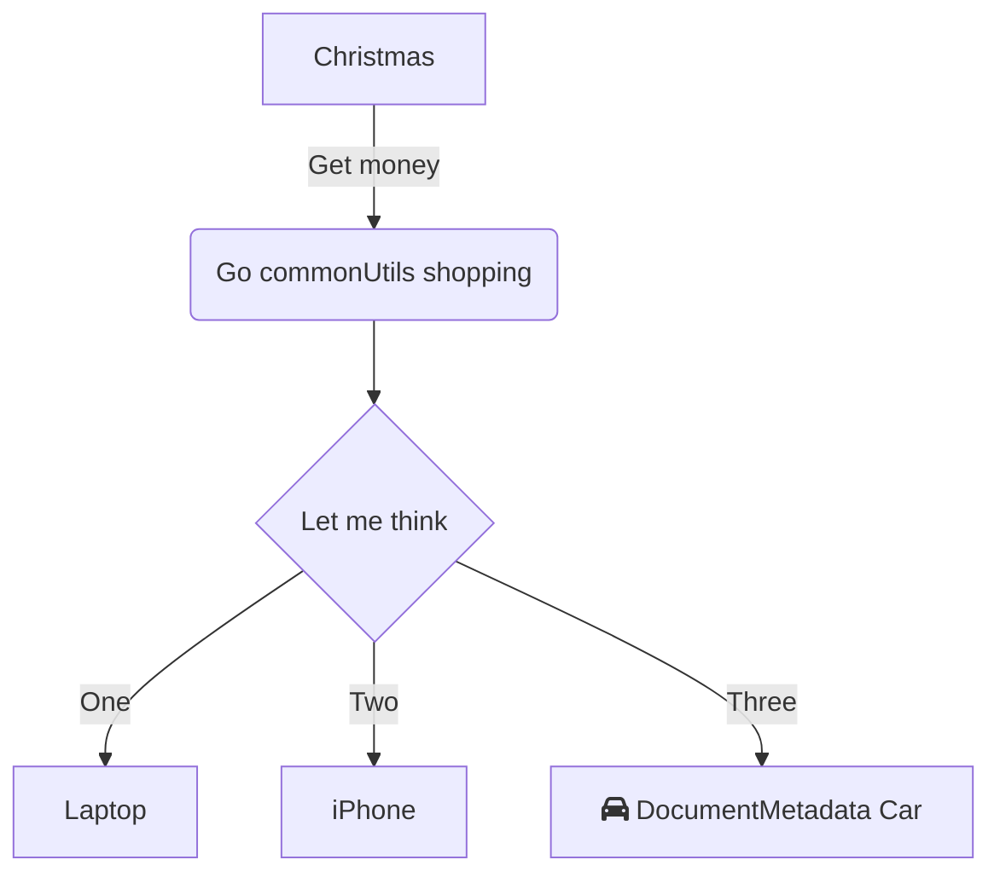

This is mermaid test. this is symbol: `commonUtils`<swm-token data-swm-token=":fileWithALotOfContent.js:14:6:6:`import * as commonUtils from &#39;./utils/common&#39;;`"/> bla

<br/>

<br/>

<br/>

Hello `commonUtils`<swm-token data-swm-token=":fileWithALotOfContent.js:14:6:6:`import * as commonUtils from &#39;./utils/common&#39;;`"/> text
<!-- NOTE-swimm-snippet: the lines below link your snippet to Swimm -->
### 📄 fileWithALotOfContent.js
```javascript
🟩 8      import { NOTIFICATION_TYPES } from 'Shared/notifications/consts';
🟩 9      import { discoverAndGenerateDocs, discoverDocs, generateDocs, sgdOnGeneratedDocSavedHandler } from './generated-docs';
🟩 10     import { DocumentMetadata, isDocumentId, isDocumentMetadata } from './generated-docs/documents/document';
🟩 11     import { RepoTarget, isRepoTarget } from './generated-docs/utils/clone';
🟩 12     import { sendSGMail } from './utils/sendgrid';
🟩 13     import { logEventCloud } from './eventLogger/logAndReportEvent';
🟩 14     import * as commonUtils from './utils/common';
🟩 15     import { firestoreCollectionNames, resourcesErrors } from './utils/consts';
🟩 16     import { checkIfRepoExistsAndUserInRepo } from './utils/check_helpers';
🟩 17     import { getLogger } from './utils/cloud-logger';
🟩 18     import { isProduction, isStage, projectId } from './utils/config';
🟩 19     
```

<br/>

<br/>

|<br>                                                                                                                         |<br>                      |`commonUtils`<swm-token data-swm-token=":fileWithALotOfContent.js:14:6:6:`import * as commonUtils from &#39;./utils/common&#39;;`"/> bla                              |
|-----------------------------------------------------------------------------------------------------------------------------|--------------------------|----------------------------------|
|Admin Dashboard                                                                                                              |?                         |<br>                              |
|IDE Creation                                                                                                                 |Acceleration              |Segev, Asaf, Eran, Eden           |
|Jetbrains IntelliJ Plugin                                                                                                    |Acceleration              |Segev, Addie, Einor               |
|Editor                                                                                                                       |Acceleration              |Asaf, Gilad Koch, Addie, Segev    |
|Playlists                                                                                                                    |Acceleration              |Daniel, Ido, maybe Asaf a little  |
|SGD Frontend                                                                                                                 |Acceleration              |Addie, Asaf, Amnon                |
|Import - markdown                                                                                                            |Acceleration              |Asaf, Addie, Itai, Fishman        |
|Jetbrains IntelliJ Plugin (legacy)                                                                                           |Acceleration              |Eden, Divo, Einor, Addie          |
|swmd parser                                                                                                                  |Acceleration              |Eden, Divo, `commonUtils`<swm-token data-swm-token=":fileWithALotOfContent.js:14:6:6:`import * as commonUtils from &#39;./utils/common&#39;;`"/> Daniel, Addie    |
|Frontend unit tests infrastructure                                                                                           |Frontend guild            |<br>                              |
|Design system                                                                                                                |Frontend Guild            |Talko, Fishman                    |
|Vue3                                                                                                                         |Frontend Guild            |Tal Koren, Yossi                  |
|Themes / Dark mode                                                                                                           |Frontend Guild            |Fishman, Talko                    |
|Launch Darkly                                                                                                                |Ground Control            |Yossi, Elad                       |
|Export (Cloud Docs / External Service)                                                                                       |Ground Control            |Amnon                             |
|Graphs in Editor                                                                                                             |Ground Control            |Dana                              |
|Sidebar Links - Documentation Hub                                                                                            |Ground Control            |Dana                              |
|Insights                                                                                                                     |Ground Control            |Amnon                             |
|Doc Hooks                                                                                                                    |Ground Control            |Itai, Amnon, Dana                 |
|Bus factor                                                                                                                   |Ground Control            |Amnon                             |
|Coverage                                                                                                                     |Ground Control            |Yossi                             |
|Backstage                                                                                                                    |Ground Control            |Itai                              |
|Checkout + Billing                                                                                                           |Ground Control            |Itai, Dana, Yossi                 |
|Paywalls infrastructure                                                                                                      |Ground Control            |Dana, Yossi                       |
|Compass                                                                                                                      |Ground Control            |Itai                              |
|Sendgrid                                                                                                                     |Ignition                  |Elad, Yossi                       |
|Segment                                                                                                                      |Ignition                  |Yossi, Daniel                     |
|Github Enterprise account                                                                                                    |Ignition                  |Eden, Fishman, Gilad Navot        |
|Import - multiple files and flies links                                                                                      |Ignition                  |<br>                              |
|App layout                                                                                                                   |Ignition                  |Fishman, Talko                    |
|Tunnel Onboarding                                                                                                            |Ignition                  |Daniel, Fishman, TalKo, Elad, Maoz|
|User profile                                                                                                                 |ignition                  |Fishman                           |
|Github Enterprise Templates                                                                                                  |Ignition                  |Fishman                           |
|Salesforce                                                                                                                   |Ignition                  |Daniel, Itai, Elad                |
|Demo Workspace                                                                                                               |Ignition                  |Fishman, Elad, Maoz               |
|Github Authentication                                                                                                        |Ignition                  |Itai, Talko                       |
|Get started checklist                                                                                                        |ignition                  |Elad, Daniel                      |
|Tooltips and help modals                                                                                                     |ignition                  |Elad, Maoz                        |
|Folder structure                                                                                                             |Ignition                  |Talko                             |
|Web app routing                                                                                                              |Ignition                  |Talko                             |
|E2E infrastructure                                                                                                           |Infra                     |Yossi, Amnon                      |
|Performance monitoring component                                                                                             |Infra                     |<br>                              |
|SGD Backend                                                                                                                  |Labs                      |Saar, Omer                        |
|Electron App                                                                                                                 |?                         |Eden, Divo, Ido, Daniel           |
|AutoSync unit testing infrastructure                                                                                         |Orbit                     |<br>                              |
|Cloud functions unit tests                                                                                                   |Orbit                     |Eran, Einor, Itai                 |
|Cloud Docs                                                                                                                   |Orbit                     |Eran, Einor                       |
|Cross Repo Docs                                                                                                              |Orbit                     |Eran                              |
|Github app                                                                                                                   |Orbit                     |Itai, Eden, Einor, maybe Amnon    |
|AutoSync                                                                                                                     |Orbit                     |Eden, Divo, Itai, Ido, Omerr      |
|Tags                                                                                                                         |Orbit                     |Jonathan, Einor, Eran             |
|Cloud Drafts                                                                                                                 |Orbit                     |Eran, Einor, Divo                 |
|CLI                                                                                                                          |Orbit                     |Divo, Eden, Ido                   |
|Slack App                                                                                                                    |Orbit                     |Einor                             |
|Workspace users management                                                                                                   |Orbit                     |Eden, Divo, Einor, Eran, Jonathan |
|PR to Doc                                                                                                                    |Orbit                     |Eden, Divo, Einor, Eran, Jonathan |
|Doc sidebar                                                                                                                  |Orbit                     |Eran                              |
|Datadog                                                                                                                      |Orbit                     |Amnon, Eden                       |
|Status page                                                                                                                  |Ignition                  |<br>                              |
|# **Repositories**                                                                                                           |<br>                      |<br>                              |
|swimm                                                                                                                        |all                       |<br>                              |
|swimm-cms                                                                                                                    |Marketing                 |Shiran                            |
|snippet-selection-poc                                                                                                        |Acceleration              |Segev                             |
|test-github-app                                                                                                              |Itai, Orbit, Groud Control|Itai, Eden                        |
|backoffice                                                                                                                   |?                         |<br>                              |
|docs.swimm.io                                                                                                                |PMs                       |Nadav                             |
|segev-intellij-playground                                                                                                    |Acceleration              |Segev                             |
|fontaweswimm (Swimm icons through the icon component)                                                                        |Frontend Guild            |Talko                             |
|squirrelly-with-units (repo for cloning for unit testing)                                                                    |?                         |Eden, Ido, Divo, Daniel           |
|swimm-ui (Design system)                                                                                                     |Frontend Guild            |Talko                             |
|learnGitBranching (repo for manual testing)                                                                                  |?                         |<br>                              |
|StorageManagerInterview (technical interview)                                                                                |Shaul                     |<br>                              |
|StorageManagerInterviewSolution (technical interview)                                                                        |Shaul                     |<br>                              |
|monkey (demos and technical interview)                                                                                       |?                         |<br>                              |
|learnGitBranching-webFlows (repo for manual testing)                                                                         |?                         |<br>                              |
|project-structure-mockup                                                                                                     |Acceleration              |Segev                             |
|swmd-3-poc                                                                                                                   |Acceleration              |Segev                             |
|e2e-squirrelly-automation (older version of the e2e repo in github enterprise, maybe not used) + version in github enterprise|Ground Control            |Amnon, Yossi                      |

<br/>

<br/>

<br/>

<!--MERMAID {width:100}-->

<!--MCONTENT {content: graph TD<br/>
A\[Christmas\] \-\-\>|Get money| B(Go `commonUtils`<swm-token data-swm-token=":fileWithALotOfContent.js:14:6:6:`import * as commonUtils from &#39;./utils/common&#39;;`"/> shopping)<br/>
B \-\-\> C{Let me think}<br/>
C \-\-\>|One| D\[Laptop\]<br/>
C \-\-\>|Two| E\[iPhone\]<br/>
C \-\-\>|Three| F\[fa:fa-car `DocumentMetadata`<swm-token data-swm-token=":fileWithALotOfContent.js:10:4:4:`import { DocumentMetadata, isDocumentId, isDocumentMetadata } from &#39;./generated-docs/documents/document&#39;;`"/> Car\]<br/>} --->

<br/>

This file was generated by Swimm. [Click here to view it in the app](http://localhost:5001/repos/Z2l0aHViJTNBJTNBdGVzdC1naXRodWItYXBwJTNBJTNBc3dpbW1pbw==/docs/rjcoj).
