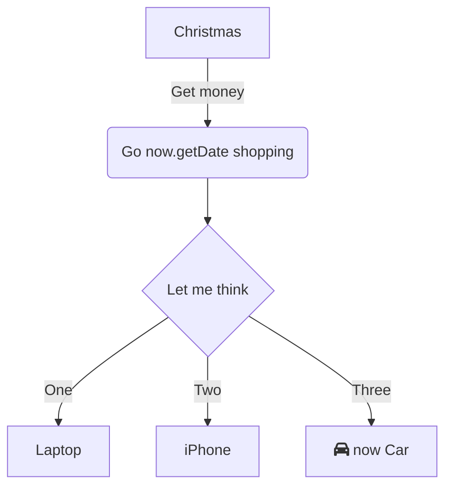

BLa

<br/>


<!-- NOTE-swimm-snippet: the lines below link your snippet to Swimm -->
### 📄 communication.js
```javascript
🟩 20         let now = new Date(),
🟩 21             startString = now.getFullYear() + "-" + (now.getMonth() + 1) + "-" + (now.getDate()),
🟩 22             end = new Date((new Date()).setDate(now.getDate() + (range || 7))),
🟩 23             endString = end.getFullYear() + "-" + (end.getMonth() + 1) + "-" + (end.getDate());
🟩 24         return [startString,endString]
```

<br/>

Hi

<br/>

<br/>

<!--MERMAID {width:100}-->

<!--MCONTENT {content: graph TD<br/>
A\[Christmas\] \-\-\>|Get money| B(Go `now.getDate`<swm-token data-swm-token=":communication.js:21:40:42:`        startString = now.getFullYear() + &quot;-&quot; + (now.getMonth() + 1) + &quot;-&quot; + (now.getDate()),`"/> shopping)<br/>
B \-\-\> C{Let me think}<br/>
C \-\-\>|One| D\[Laptop\]<br/>
C \-\-\>|Two| E\[iPhone\]<br/>
C \-\-\>|Three| F\[fa:fa-car `now`<swm-token data-swm-token=":communication.js:20:3:3:`    let now = new Date(),`"/> Car\]<br/>} --->

<br/>

This file was generated by Swimm. [Click here to view it in the app](http://localhost:5001/repos/ls4DA2fLasmQuEbT4ipw/docs/pudrk).