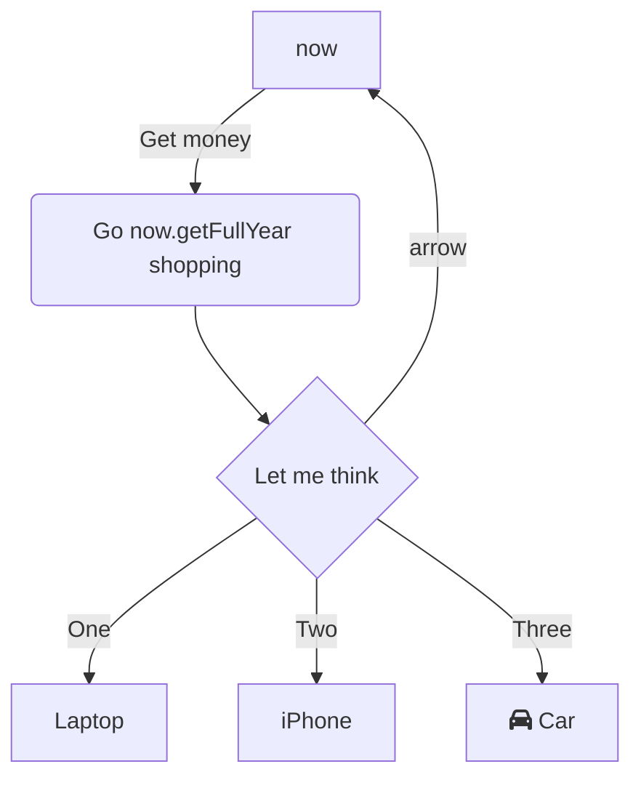

Hello `now`[<sup id="Zar53m">↓</sup>](#f-Zar53m) bla

<br/>

<br/>
<!-- NOTE-swimm-snippet: the lines below link your snippet to Swimm -->
### 📄 communication.js
```javascript
⬜ 17     gtdb
⬜ 18     gtd
⬜ 19     shyjyrwhyrwt
🟩 20         let now = new Date(),
🟩 21             startString = now.getFullYear() + "-" + (now.getMonth() + 1) + "-" + (now.getDate()),
🟩 22             end = new Date((new Date()).setDate(now.getDate() + (range || 7))),
🟩 23             endString = end.getFullYear() + "-" + (end.getMonth() + 1) + "-" + (end.getDate());
🟩 24         return [startString,endString]
⬜ 25     };
⬜ 26     
⬜ 27     /**
```

<br/>

Hello again

<br/>

<!--MERMAID {width:100}-->

<!--MCONTENT {content: graph TD<br/>
A\[Christmas\] \-\-\>|Get money| B(Go `now.getFullYear`[<sup id="7zIQQ">↓</sup>](#f-7zIQQ) shopping)<br/>
B \-\-\> C{Let me think}<br/>
C \-\-\>|One| D\[Laptop\]<br/>
C \-\-\>|Two| E\[iPhone\]<br/>
C \-\-\> |arrow| A\[`now`[<sup id="Zar53m">↓</sup>](#f-Zar53m)\]<br/>
C \-\-\>|Three| F\[fa:fa-car Car\]} --->

<br/>

<!-- THIS IS AN AUTOGENERATED SECTION. DO NOT EDIT THIS SECTION DIRECTLY -->
### Swimm Note

<span id="f-Zar53m">now</span>[^](#Zar53m) - "communication.js" L20
```javascript
    let now = new Date(),
```

<span id="f-7zIQQ">now.getFullYear</span>[^](#7zIQQ) - "communication.js" L21
```javascript
        startString = now.getFullYear() + "-" + (now.getMonth() + 1) + "-" + (now.getDate()),
```

<br/>

This file was generated by Swimm. [Click here to view it in the app](http://localhost:5001/repos/ls4DA2fLasmQuEbT4ipw/docs/7obgf).
