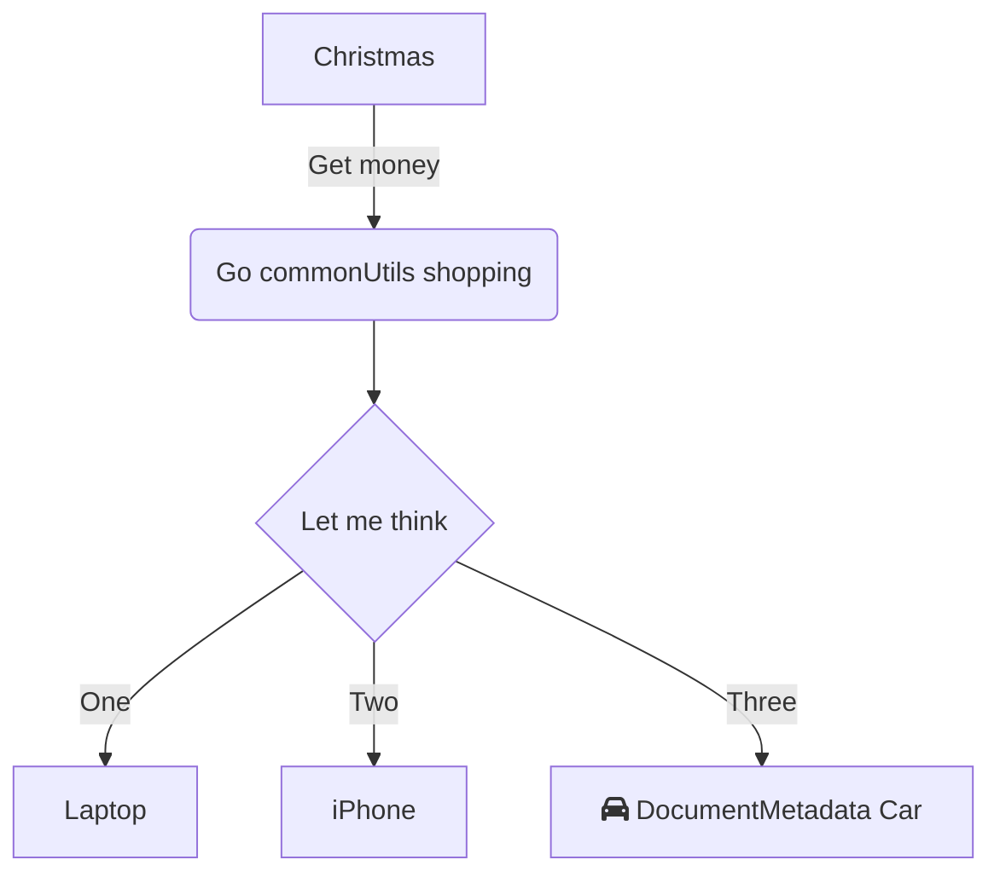
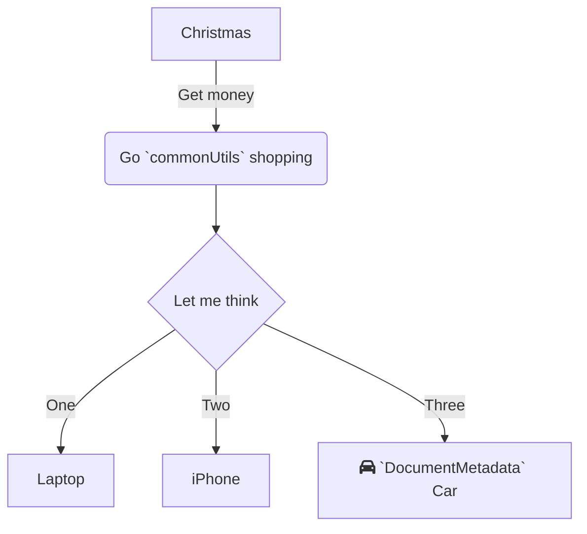

Hello

<!--MERMAID {width:100}-->

<!--MCONTENT {content: graph TD 
A\[Christmas\] \-\-\>|Get money| B(Go `commonUtils`<swm-token data-swm-token=":fileWithALotOfContent.js:14:6:6:`import * as commonUtils from &#39;./utils/common&#39;;`"/> shopping) 
B \-\-\> C{Let me think} 
C \-\-\>|One| D\[Laptop\] 
C \-\-\>|Two| E\[iPhone\] 
C \-\-\>|Three| F\[fa:fa-car `DocumentMetadata`<swm-token data-swm-token=":fileWithALotOfContent.js:10:4:4:`import { DocumentMetadata, isDocumentId, isDocumentMetadata } from &#39;./generated-docs/documents/document&#39;;`"/> Car\] } --->

<!--MERMAID {width:100}-->

<!--MCONTENT {content: graph TD 
A\[Christmas\] \-\-\>|Get money| B(Go `commonUtils`<swm-token data-swm-token=":fileWithALotOfContent.js:14:6:6:`import * as commonUtils from &#39;./utils/common&#39;;`"/> shopping) 
B \-\-\> C{Let me think} 
C \-\-\>|One| D\[Laptop\] 
C \-\-\>|Two| E\[iPhone\] 
C \-\-\>|Three| F\[fa:fa-car `DocumentMetadata`<swm-token data-swm-token=":fileWithALotOfContent.js:10:4:4:`import { DocumentMetadata, isDocumentId, isDocumentMetadata } from &#39;./generated-docs/documents/document&#39;;`"/> Car\] } --->

