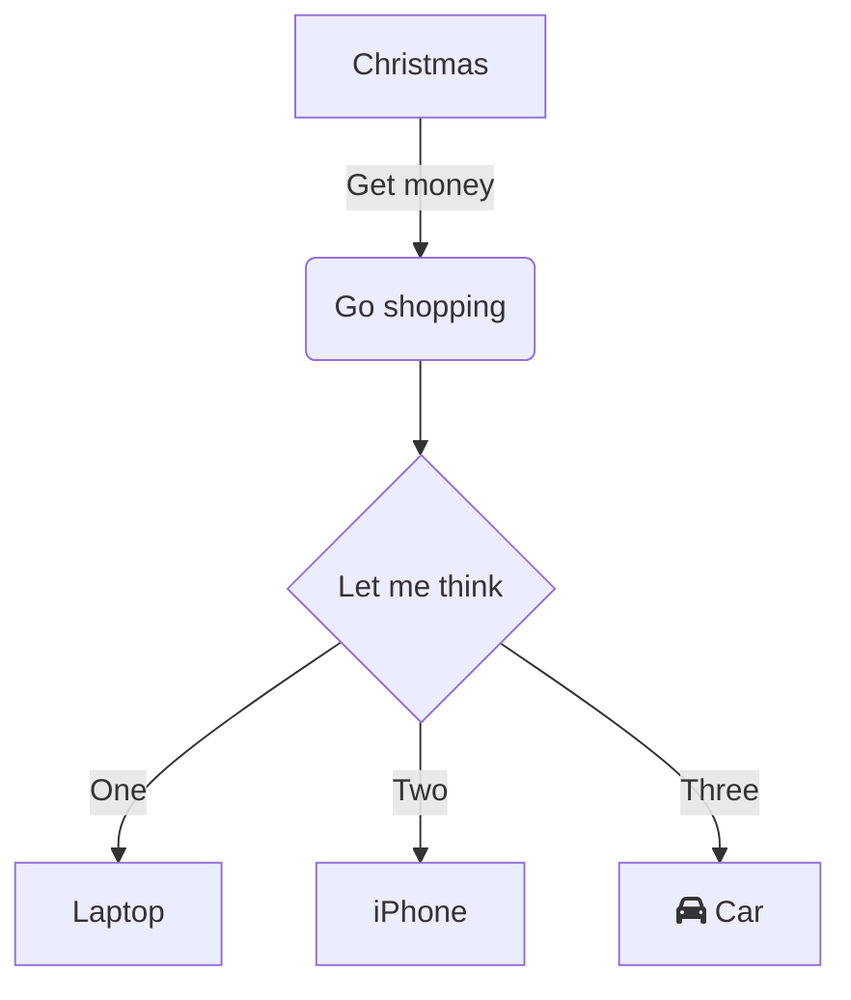

vbgfnhdgf

 

 

<!--MERMAID {width:100}-->

<!--MCONTENT {content: graph TD 
A\[Christmas\] \-\-\>|Get money| B(Go shopping)

 

 
B \-\-\> C{Let me think} 
C \-\-\>|One| D\[Laptop\] 
C \-\-\>|Two| E\[iPhone\]

 

 

 
C \-\-\>|Three| F\[fa:fa-car Car\]

 

 

 

 } --->

 

END

 

This file was generated by Swimm. [Click here to view it in the app](http://localhost:5001/repos/ls4DA2fLasmQuEbT4ipw/docs/2ayn8).